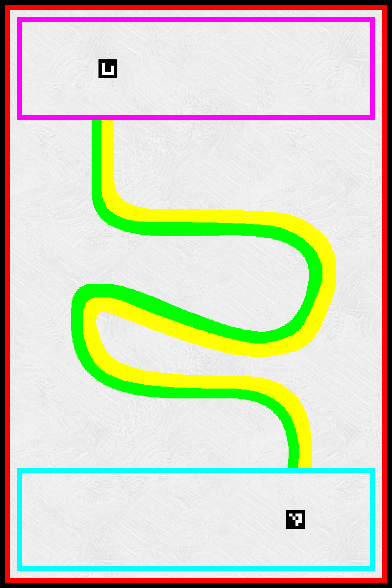

Welcome to my embedded systems engineering portfolio

# Overview
## About myself
I am an aeronautical engineering student from IPSA in Paris, currently conducting my end of studies internship in a laboratory. Throughout my studies, and mostly during internships and through associative work, I have come to learn to use multiple tools for the design and automation of UAVs. 

Although I had the opportunity to participate in multiple UAV design challenges, the results never met my expectations due to reasons outside of my control. These shortcomings led me to decide to remake a project similar to the UAV design challenges on my own.

In my professional experience, I have been frequently working with PX4 SITL. My works combined system architecture design, PCB design, drone design, optronics, image processing, AI, simulation, swarming, sensor fusion, control and automation, and firmware development in C/C++.

## About the project
This project is a demonstration of my knowledge in various fields related to embedded systems engineering. The demonstration takes inspiration from PlanetScience's Droneload UAV challenge.

Using the PX4 autopilot stack, my goal is to automate UAVs to perform multiple tasks such as :
- Autonomous take-off and landing
- Line following using a monocular camera
- Obstacle avoidance
- Image detection using a custom trained YOLOv11 model
- Precision landing using Aruco markers
- Windows traversal
- Collaboration with a ground robot through wireless communication.

For economic reasons, the whole project is simulated using PX4 SITL with the Gazebo simulator. HITL experiments will be conducted if I acquire or borrow a Pixhawk FMU. 

## My engagements
To keep this project meaningful, **nothing in this repository was made using any AI assistant**, including codes, documentation, explanations or anything else an AI assistant could be used for.

To guarantee that this project is entirely human made, all my sources are cited at the end of this document.
Knowledge I acquired during my studies which did not require to look for documentation online is not listed.

## Demo videos
Once this project is over, I will post videos explaining each step that was performed in order to complete it as well as demonstrations of the simulations.

# Basics
## Versions
Here are the software versions used for this project:
- Operating System: Ubuntu 24.04 LTS Noble
- PX4 : 1.14
- ROS2 : Jazzy Jalisco
- Gazebo : Harmonic
- Blender : 4.5 lts / 4.5.8
- Krita : 5.2.11
- Python : 3.12.3
- Micro-XRCE-DDS-Agent : 1.0.2
- YOLO : v11

## Setup
Using Ubuntu, clone this repo to `$HOME/ros2_jazzy/src` then run `bash px4_portfolio/extra/setup.sh`. Make sure to have ROS2 installed on your computer beforehand.

## PX4 Operation
The PX4 autopilot is a software which runs on a Flight Management Unit (FMU). The FMU can be seen as the brain of a drone, reading data from main sensors (IMU, barometer, magnometer, GNSS), and sending control commands to Electronic Speed Controllers (ESCs), which make the drone's motors rotate at a set speed in order to fly.

PX4 being open source, its source code can be modified, which we will not do for this project. Instead, an easier way to use PX4 is to keep the base firmware and to tune UAV parameters based on our needs. The parameters that can be modified, their meaning, and possible values are listed [here](https://docs.px4.io/main/en/advanced_config/parameter_reference).

To monitor and communicate with UAVs, we need a Ground Control System (GCS) such as [QGroundControl](https://qgroundcontrol.com/). The GCS allows us to tune the parameters of the UAV, to give it a mission to execute (takeoff, fly somewhere, perform a task, land...), to control it using an RC controller, and to change its flight modes.

The flight modes define how the UAV behaves, how it reacts to commands, and which commands it reacts to. In this project, the flight mode we are interested in is the Offboard mode. This mode is called as such because the commands come from an external source (off the board) such as a companion computer. 

The FMU and the companion computer exchange data throughout the flight, allowing us to automate the actions performed by the UAV. Briefly, the data sent out by the FMU is comprised of state flags, Kalman filter estimations of the state of the UAV, and other information about the flight. The companion computer can take these data and combine them with sensors data such as cameras to compute a movement to perform. The movement can be a position to go to, a velocity to reach, an attitude, rates, etc.

To switch to Offboard mode and to remain in it, the companion computer must send a continuous stream of commands to the UAV about how to interpret its commands, and what movements to perform. In this manner, PX4 can be seen as a kind of hardware abstraction layer for the higher-level companion computer. Therefore, this project focuses mainly on the algorithms run on the companion computer.

Another important aspect of PX4 is its built-in SITL (Software In The Loop) and HITL (Hardware In The Loop) capabilities. SITL can be summarized as a complete simulation of a UAV running PX4. Both the physics simulation and computations are run on a computer. HITL uses real hardware such as a Pixhawk FMU and a Raspberry Pi companion computer to perform the computations while the physics are still simulated on a computer. HITL allows us to verify the the UAV will have the required processing power to fly properly.

Multiple simulators are available for simulation [here](https://docs.px4.io/main/en/simulation/#supported-simulators). We will use Gazebo Harmonic for compatibility reasons.

## ROS2 Use
The Robot Operating System (ROS2) is the software that runs on the companion computer. ROS2 is a real time software which allows multiple programs to run in parallel on a computer to meet critical deadlines. Each program is called a Node which exchanges data using messages sent through public topics. A collection of nodes is called a package. A package is usually built for a specific task.

The instances which send and receive messages from topics are called publishers and subscribers respectively. For this project, our nodes will subscribe to topics which come from other ROS2 nodes and from topics which come from PX4 or Gazebo. Commands will then be published to topics read by PX4 as commands.

## Workflow and Communications
To run a SITL simulation with PX4, Gazebo and ROS2, we need to start multiple software in parallel. First, PX4 and Gazebo can be started together with `cd $HOME/PX4-Autopilot && make px4_sitl gz_x500`.

In another terminal, we can start the software which acts as a bridge between PX4 and ROS2. Natively, PX4 uses its own custom uORB messages to communicate data between its internal modules. The [Micro-XRCE-DDS-Agent](https://docs.px4.io/v1.16/en/middleware/uxrce_dds) takes these uORB messages and converts them to ROS2-readable topics and vice-versa. The entire bridging process is automatic once started with `micro-xrce-dds-agent udp4 -p 8888`. I installed the agent with the snap command instead of building it from source.

Once the simulation is running and the uXRCE-DDS agent is ready, ROS2 nodes can be run. By running `cd $HOME/ros2_jazzy && ros2 run ros_px4_com offboard_control` in a new terminal, the UAV should take-off and hover in the simulation.

Lastly, to allow ROS2 to receive and send data to Gazebo, the ROS2 node ros_gz_bridge must be run. This node takes either a .yaml configuration file as input or a conversion in a command line. Similarly to PX4 and ROS2, Gazebo also works with topics in its own format. The bridge needs to know the name of one topic to bridge it to the other software, the ROS2 type of the topic, and its Gazebo type equivalent. To retrieve all these data, the commands `ros2 topic list`, `ros2 topic info -v`, `gz topic -l`, `gz topic -i -t` can be used. Otherwise, a table with the types is available [here](https://github.com/gazebosim/ros_gz/tree/jazzy/ros_gz_bridge). Without a configuration file, the bridge can be run with `ros2 run ros_gz_bridge parameter_bridge <topic_name>@<ros2_topic_type>@<gz_topic_type>`.

## Missions
### Mission Arena
This is the texture used for the mission arena :

It was made using Krita and fits a 8m x 12m playground. The cyan zone is the take-off area, while the purple one is the landing area. The border of the playground is marked with a red line to never cross, and the ground is textured to allow the UAV's optical flow sensor to perform its designed task properly. An Aruco marker with id 0 is placed at the starting point and a marker with id 10 is placed at the landing point. This is only the base ground texture. Depending on the mission, the map will be modified with elements such as windows, images, and a roaming robot on the ground. In total, three versions of the map will be available to the UAV.

Let's now explain each of the missions performed by the UAV.

### Mission 1 - Line following
The first mission of the UAV is to follow a line made of a yellow and a green segment on the ground. The goal it to take-off, follow the line with a **constant** yaw until the landing aruco is in sight to perform a precision landing on it. The UAV must then disarm for a few seconds before rearming and taking-off again. The line must be followed again on the way back, but with a yaw that follows the curvature of the line until the starting point is visible again. The UAV must perform a precision landing again and the mission is over.

### Mission 2 - Windows crossing
The second mission can be conducted on the same map as the line following one. The idea this time is to cross three windows. The windows are part of the map and are **not** indicated by any Aruco marker. Using only a monocular camera, the drone must manage to cross the three windows at least once in any direction in a single flight without crashing. The goal of this mission is to force myself to use a depth estimation model found on Hugging Face to infer usable data instead of a stereo camera.

### Mission 3 - Image detection and virtual package delivery
The third mission takes place on a different version of the map, with images on the ground. For this mission, the UAV must take-off and search the area for a specific image. Once the image is detected, the UAV must go and land in the landing area to simulate a package collection, then fly back to the detected position and land on the image, before flying back to the starting point to land again. This mission should be made using a fine-tuned YOLOv11 model, and false images are placed on the ground to challenge the model's accuracy.

### Mission 4 - Wireless collaboration with a Rover
The fourth and last mission of this project is about collaboration with ground units/ wireless communications. For this mission, a rover roams inside the arena with random movements. An aruco marker with id 5 is attached on its back and the UAV can observe or follow it as needed. The rover can roam anywhere in the arena but never exit its bounds. For the rover to start moving, the UAV must send a periodic signal 0xFF. If the rover drives over the aruco marker 10, the UAV must stop sending the signal to the rover and land on the starting point.    

# In practice
## Implementation
### Global idea
To implement the different control strategies for each mission, the algorithm relies on a few key mechanics. First, since the steps to perform a mission a known, we can use basic finite state machines with states which match the different tasks to perform. Secondly, multiple tasks involve using visual clues to guide the UAV. Thus, a guidance algorithm which moves the UAV based on standardized target position values can allow for an easy implementation of all the stabilization tasks (line following, precision landing, landing on an image, crossing windows...).

To simulate an accurate indoor UAV, this project is GNSS free. I made a UAV model combining the x500, forward facing monocular camera, downward facing monocular camera, optical flow sensor, and downward facing Lidar. The Lidar acts as a complement to the barometer and IMU for the height estimation of the state Kalman filer, and the optical flow sensor sends translational data for the x and y movements of the UAV. This way, the UAV can navigate without GNSS data and without performing pure dead reckoning.

As previously stated, PX4 operates using parameters and flags, which can be setup either dynamically using QGroundControl or the UAV's NuttX shell, or before the execution of the simulation using the model files. The GNSS flags are therefore set to disable it and detect 0 satellite, and every other snesor is set to be used.

### Mission 1
 

## Sources
### PX4 Autopilot
- [PX4 Docs](https://docs.px4.io/v1.16/en/)
- [Setup](https://docs.px4.io/v1.16/en/dev_setup/dev_env_linux_ubuntu)
- [uXRCE-DDS](https://docs.px4.io/v1.16/en/middleware/uxrce_dds)
- [ROS2 Guide](https://docs.px4.io/v1.16/en/ros2/user_guide)
- [ROS2 Example](https://docs.px4.io/v1.16/en/ros2/offboard_control)

### Gazebo
- [Setup](https://gazebosim.org/docs/harmonic/ros_installation/)
- [ros_gz_bridge git](https://github.com/gazebosim/ros_gz/tree/jazzy/ros_gz_bridge)

### ROS2 Jazzy
- [ROS2 Docs](https://docs.ros.org/en/jazzy/)
- [Setup](https://docs.ros.org/en/jazzy/Installation/Ubuntu-Install-Debs.html)
- [Package Creation](https://docs.ros.org/en/jazzy/How-To-Guides/Developing-a-ROS-2-Package.html)
- [Publisher/Subscriber](https://docs.ros.org/en/jazzy/Tutorials/Beginner-Client-Libraries/Writing-A-Simple-Cpp-Publisher-And-Subscriber.html)

### Aruco Detection
- [ros_aruco_opencv git](https://github.com/fictionlab/ros_aruco_opencv)

### Image detection
- [YOLO Docs](https://docs.ultralytics.com/)
- [YOLO in C++ with OpenCV](https://medium.com/@siromermer/running-yolo-models-in-c-for-object-detection-a698b3b7cd5f)
- [Image Augmentation](https://pypi.org/project/albumentations/)
- [Image Augmentation Example](https://albumentations.ai/docs/examples/example-bboxes/)
- [Dataset Generation]
- [Fine Tuning](https://docs.ultralytics.com/guides/hyperparameter-tuning/)

### 

